# 📋 FLYAMASTER 文档整合计划 (MD Consolidation Plan)

**创建时间**: 2026-01-22
**状态**: 待审批
**目标**: 将分散在 `plans/` 和 `plans/docs/` 两个目录的 23 个 MD 文件整合为 9 个核心文档

---

## 1. 当前文件分布分析

### 1.1 plans/ 根目录 (9 个文件)

| 文件名 | 大小 | 内容摘要 | 处理方式 |
|--------|------|----------|----------|
| `03_issue_tracker.md` | 19KB | 25个问题追踪 | **保留为主版本** |
| `04_algo_design.md` | 11KB | Mahony/PID/混控算法 | **保留为主版本** |
| `05_changelog.md` | 19KB | FW v1.0.0 ~ v2.1.5 | **保留为主版本** |
| `05_History_Log.md` | 6KB | 早期开发历史归档 | 合并到 05_changelog.md |
| `07_research_and_ideas.md` | 7KB | EKF分析/芯片评估 | **保留为主版本** |
| `08_hardware_design.md` | 27KB | 完整引脚分配/DMA配置 | **保留为主版本** |
| `development_progress_log.md` | 5KB | 开发进度日志 | 合并到 05_changelog.md |
| `interface_definition.md` | 25KB | 结构体/函数/宏定义 | **重命名为 01_definitions.md** |
| `issues_and_feedback.md` | 26KB | Bug/Risk/Feedback | 合并到 03_issue_tracker.md |

### 1.2 plans/docs/ 子目录 (14 个文件)

| 文件名 | 大小 | 内容摘要 | 处理方式 |
|--------|------|----------|----------|
| `01_Project_Master_Plan.md` | 2KB | 项目愿景/里程碑 | 提取到 02_project_roadmap.md |
| `02_Hardware_Architecture.md` | 2KB | 旧版硬件架构 (F407) | **废弃** → 已被 08 替代 |
| `02_Schematic_Design_Guide.md` | 7KB | 原理图设计指南 | 合并到 08_hardware_design.md |
| `04_Module_Drivers_Deep_Dive.md` | 2KB | 驱动模块说明 | 合并到 01_definitions.md |
| `05_changelog.md` | 2KB | 旧版变更日志 | **废弃** → 已被根目录版本替代 |
| `05_History_Log.md` | 6KB | 开发历史归档 | **废弃** → 与根目录重复 |
| `07_research_and_ideas.md` | 7KB | 调研分析 | **废弃** → 与根目录重复 |
| `08_Physics_and_Safety_Upgrade.md` | 5KB | 物理安全强化方案 | 合并到 08_hardware_design.md |
| `09_Critical_Safety_Patch_Plan.md` | 3KB | 关键安全补丁计划 | 合并到 03_issue_tracker.md |
| `csdn_blog_outline.md` | 2KB | CSDN博客大纲 | **废弃** → 非核心文档 |
| `development_progress_log.md` | 2KB | 开发进度日志 | **废弃** → 与根目录重复 |
| `FLYAMASTER_v2.0_Whitepaper.md` | 12KB | 项目架构白皮书 | 提取到 06_operation_guide.md |
| `interface_definition.md` | 25KB | 接口定义 | **废弃** → 与根目录重复 |
| `issues_and_feedback.md` | 12KB | 问题反馈 | **废弃** → 与根目录重复 |

---

## 2. 整合后的目标结构

```
plans/
├── README.md                    # [新建] 项目总览与索引
├── 01_definitions.md            # [重命名] 命名规范与接口定义
├── 02_project_roadmap.md        # [新建] 项目路线图
├── 03_issue_tracker.md          # [整合] 问题追踪日志
├── 04_algo_design.md            # [保留] 算法设计
├── 05_changelog.md              # [整合] 版本更新日志
├── 06_operation_guide.md        # [新建] 操作指南
├── 07_research_and_ideas.md     # [保留] 调研分析
├── 08_hardware_design.md        # [整合] 硬件设计
├── archive/                     # [新建] 废弃文档归档
│   ├── 02_Hardware_Architecture.md.deprecated
│   ├── csdn_blog_outline.md.deprecated
│   └── ...
└── .kilocode/                   # 规则配置
    └── rules/
        └── rules.md
```

---

## 3. 详细整合方案

### 3.1 README.md (新建)

**来源**: 从 `01_Project_Master_Plan.md` 和 `FLYAMASTER_v2.0_Whitepaper.md` 提取

**内容结构**:
```markdown
# 🚁 FLYAMASTER 飞控项目

## 项目简介
## 技术栈 (MCU/RTOS/EDA)
## 文档索引 (链接到 01-08)
## 快速开始
```

---

### 3.2 01_definitions.md (重命名 + 合并)

**主版本**: `plans/interface_definition.md` (772行, 25KB)
**合并来源**: `docs/04_Module_Drivers_Deep_Dive.md` (驱动模块说明)

**处理方式**:
1. 将 `interface_definition.md` 重命名为 `01_definitions.md`
2. 将 `04_Module_Drivers_Deep_Dive.md` 中的驱动配置信息合并到相应章节

---

### 3.3 02_project_roadmap.md (新建)

**来源**: 从 `01_Project_Master_Plan.md` 提取里程碑和待办事项

**内容结构**:
```markdown
# 📅 项目路线图

## ✅ Phase 1: 基础飞行 [已完成]
## ✅ Phase 2: 进阶功能 [已完成]
## 🚧 Phase 3: 智能化与优化 [进行中]
- [ ] EKF 状态估计
- [ ] 航点飞行
- [ ] 视觉避障
- [ ] 自动返航
## 📋 Phase 4: 硬件设计 [待开始]
- [ ] 原理图设计
- [ ] PCB 布局
- [ ] 打样验证
```

---

### 3.4 03_issue_tracker.md (整合)

**主版本**: `plans/03_issue_tracker.md` (644行, 19KB)
**合并来源**:
- `plans/issues_and_feedback.md` (591行, 26KB)
- `docs/issues_and_feedback.md` (288行, 12KB) - 旧版本
- `docs/09_Critical_Safety_Patch_Plan.md` (54行, 3KB)

**处理方式**:
1. 保留主版本的所有内容
2. 从 `issues_and_feedback.md` 提取未记录的 Issue/Risk
3. 将 `09_Critical_Safety_Patch_Plan.md` 的安全补丁计划转为 Issue 条目

---

### 3.5 04_algo_design.md (保留)

**主版本**: `plans/04_algo_design.md` (415行, 11KB)

**处理方式**: 无需修改，已是最新版本

---

### 3.6 05_changelog.md (整合)

**主版本**: `plans/05_changelog.md` (434行, 19KB)
**合并来源**:
- `plans/05_History_Log.md` (118行, 6KB)
- `plans/development_progress_log.md` (95行, 5KB)
- `docs/05_changelog.md` (35行, 2KB) - 旧版本
- `docs/05_History_Log.md` (118行, 6KB) - 重复
- `docs/development_progress_log.md` (25行, 2KB) - 旧版本

**处理方式**:
1. 保留主版本的所有内容
2. 将 `05_History_Log.md` 的早期开发历史添加到 "归档" 章节
3. 将 `development_progress_log.md` 的进度日志按日期合并

---

### 3.7 06_operation_guide.md (新建)

**来源**: 从 `FLYAMASTER_v2.0_Whitepaper.md` 提取

**内容结构**:
```markdown
# 📖 操作指南

## 1. 开发环境搭建
- Keil MDK 配置
- CubeMX 配置
- VSCode 配置

## 2. 编译与烧录
- 编译步骤
- 烧录方法 (SWD/DFU)

## 3. 调试工具
- 匿名上位机 V7
- USB 虚拟串口

## 4. 飞行操作
- 解锁/上锁
- 飞行模式切换
- 失控保护
```

---

### 3.8 07_research_and_ideas.md (保留)

**主版本**: `plans/07_research_and_ideas.md` (120行, 7KB)

**处理方式**: 无需修改，已是最新版本
- `docs/07_research_and_ideas.md` 与根目录版本完全相同，直接删除

---

### 3.9 08_hardware_design.md (整合)

**主版本**: `plans/08_hardware_design.md` (635行, 27KB)
**合并来源**:
- `docs/02_Schematic_Design_Guide.md` (150行, 7KB) - 原理图设计指南
- `docs/08_Physics_and_Safety_Upgrade.md` (103行, 5KB) - 物理安全强化

**处理方式**:
1. 保留主版本的所有内容
2. 将 `02_Schematic_Design_Guide.md` 的原理图设计指南添加为新章节
3. 将 `08_Physics_and_Safety_Upgrade.md` 的安全强化方案添加为新章节

---

## 4. 废弃文件处理

### 4.1 废弃标记格式

对于废弃的内容，使用以下格式标记：

```markdown
> ⚠️ **[DEPRECATED]** 废弃于: 2026-01-22
> - **废弃原因**: [原因说明]
> - **替代方案**: [新文档/新章节的链接]
> - **原始文件**: [原文件路径]
```

### 4.2 废弃文件列表

| 原文件 | 废弃原因 | 替代方案 |
|--------|----------|----------|
| `docs/02_Hardware_Architecture.md` | 基于旧版 F407，已迁移到 F405 | `08_hardware_design.md` |
| `docs/05_changelog.md` | 内容已合并到根目录版本 | `05_changelog.md` |
| `docs/05_History_Log.md` | 与根目录版本重复 | `05_changelog.md` |
| `docs/07_research_and_ideas.md` | 与根目录版本重复 | `07_research_and_ideas.md` |
| `docs/development_progress_log.md` | 内容已合并 | `05_changelog.md` |
| `docs/interface_definition.md` | 与根目录版本重复 | `01_definitions.md` |
| `docs/issues_and_feedback.md` | 内容已合并 | `03_issue_tracker.md` |
| `docs/csdn_blog_outline.md` | 非核心文档，仅供参考 | 移至 `archive/` |

---

## 5. 整合流程图

```mermaid
flowchart TD
    subgraph 源文件
        A1[plans/interface_definition.md]
        A2[plans/03_issue_tracker.md]
        A3[plans/04_algo_design.md]
        A4[plans/05_changelog.md]
        A5[plans/07_research_and_ideas.md]
        A6[plans/08_hardware_design.md]
        A7[plans/issues_and_feedback.md]
        A8[plans/05_History_Log.md]
        A9[plans/development_progress_log.md]
        
        B1[docs/01_Project_Master_Plan.md]
        B2[docs/02_Schematic_Design_Guide.md]
        B3[docs/04_Module_Drivers_Deep_Dive.md]
        B4[docs/08_Physics_and_Safety_Upgrade.md]
        B5[docs/09_Critical_Safety_Patch_Plan.md]
        B6[docs/FLYAMASTER_v2.0_Whitepaper.md]
    end
    
    subgraph 目标文件
        C0[README.md]
        C1[01_definitions.md]
        C2[02_project_roadmap.md]
        C3[03_issue_tracker.md]
        C4[04_algo_design.md]
        C5[05_changelog.md]
        C6[06_operation_guide.md]
        C7[07_research_and_ideas.md]
        C8[08_hardware_design.md]
    end
    
    B1 --> C0
    B6 --> C0
    
    A1 --> C1
    B3 --> C1
    
    B1 --> C2
    
    A2 --> C3
    A7 --> C3
    B5 --> C3
    
    A3 --> C4
    
    A4 --> C5
    A8 --> C5
    A9 --> C5
    
    B6 --> C6
    
    A5 --> C7
    
    A6 --> C8
    B2 --> C8
    B4 --> C8
```



---

## 6. 执行步骤

### Step 1: 创建目录结构
- [ ] 创建 `plans/archive/` 目录

### Step 2: 创建新文件
- [ ] 创建 `README.md`
- [ ] 创建 `02_project_roadmap.md`
- [ ] 创建 `06_operation_guide.md`

### Step 3: 重命名文件
- [ ] `interface_definition.md` → `01_definitions.md`

### Step 4: 整合内容
- [ ] 整合 `01_definitions.md` (合并驱动模块说明)
- [ ] 整合 `03_issue_tracker.md` (合并 issues_and_feedback + 安全补丁)
- [ ] 整合 `05_changelog.md` (合并历史日志 + 进度日志)
- [ ] 整合 `08_hardware_design.md` (合并原理图指南 + 安全强化)

### Step 5: 处理废弃文件
- [ ] 将废弃文件移至 `archive/` 并添加 `.deprecated` 后缀
- [ ] 在废弃文件开头添加废弃标记

### Step 6: 更新配置
- [ ] 更新 `.kilocode/rules/rules.md` 中的路径配置

### Step 7: 清理
- [ ] 删除 `plans/docs/` 目录 (所有内容已整合或归档)

---

## 7. 确认事项

请确认以下问题：

1. **废弃文件处理方式**: 
   - 方案 A: 移至 `archive/` 目录保留
   - 方案 B: 直接删除 (内容已整合)
   - **推荐**: 方案 A (保留历史记录)

2. **docs/ 目录处理**:
   - 整合完成后是否删除 `docs/` 子目录？
   - **推荐**: 删除，所有内容统一放在 `plans/` 根目录

3. **是否需要保留 CSDN 博客大纲**:
   - 这是非核心文档，但可能对后续写博客有参考价值
   - **推荐**: 移至 `archive/` 保留

---

**请审阅此计划，如有修改意见请告知。确认后我将切换到 Code 模式执行整合操作。**